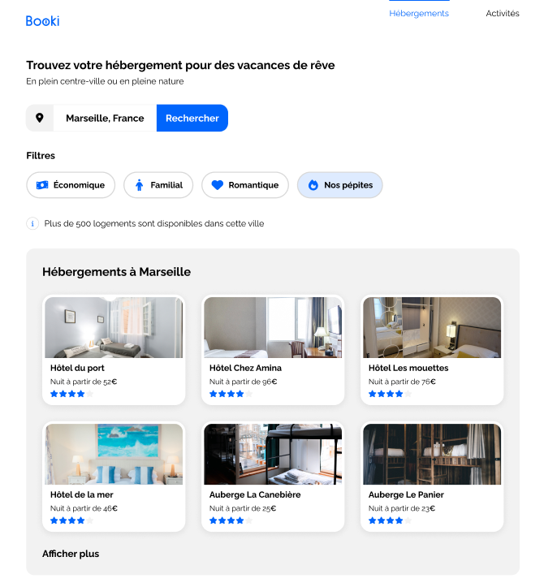
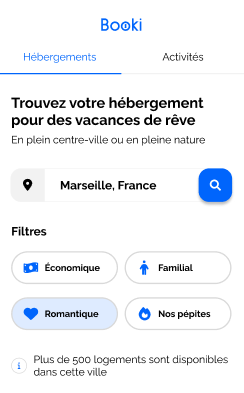

**# booki
Booki est une agence de voyage, 
elle propose un propose des services de réservation d'hébergement en ligne. 

Merci pour cette soutenance ! :)
**# Booki - Agence de Voyage en Ligne

Bienvenue dans le README du projet Booki, un site d'agence de voyage en ligne. Dans ce projet, j'ai joué le rôle de développeur front-end, contribuant à la création d'une plateforme conviviale pour la recherche et la réservation de voyages. Ce README vous fournira un aperçu du projet, de mes contributions et des technologies utilisées.

## Aperçu

Booki est une plateforme en ligne qui permet aux voyageurs de rechercher, explorer et réserver des destinations de voyage passionnantes. En tant que développeur front-end, mon objectif était de créer une interface utilisateur engageante et réactive en utilisant HTML et CSS, tout en mettant en œuvre des animations CSS dynamiques pour améliorer l'expérience utilisateur.

## Fonctionnalités

- Recherche de destinations de voyage en fonction de critères tels que la destination, les dates, les préférences, etc.
- Présentation attrayante des destinations avec des images, des descriptions et des offres spéciales.
- Processus de réservation fluide et intuitif.
- Utilisation d'animations CSS pour rendre les interactions plus dynamiques et agréables.
- Respect des spécifications techniques et des contraintes fonctionnelles établies dans Figma.

## Technologies Utilisées

- HTML pour la structure de la page et l'intégration des éléments.
- CSS pour la mise en forme visuelle et les animations.
- Figma pour consulter les maquettes, suivre les spécifications et les contraintes de design.
- Git pour la gestion du contrôle de version du code source.

## Contributions Personnelles

En tant que développeur front-end, mes principales contributions au projet Booki incluent :

- La conversion des maquettes fournies en code HTML et CSS, tout en garantissant une mise en page responsive.
- L'ajout d'animations CSS pour améliorer l'expérience utilisateur et rendre les interactions plus fluides.
- L'application des styles conformément aux spécifications de design et aux contraintes fonctionnelles définies dans Figma.

## Instructions d'Installation

1. Clonez ce dépôt sur votre machine locale.
2. Naviguez vers le dossier du projet.
3. Ouvrez le fichier `index.html` dans votre navigateur pour visualiser le site.

## Captures d'Écran

---

Ce projet a été une opportunité passionnante pour moi d'explorer la création d'interfaces utilisateur conviviales en suivant des maquettes et des directives spécifiques. J'espère que le résultat final contribuera à inspirer les voyageurs à explorer de nouvelles destinations.

Pour toute question ou collaboration, n'hésitez pas à me contacter.

**Développeur Front-End:** Lucas O.
**Date:** MAI 2023
